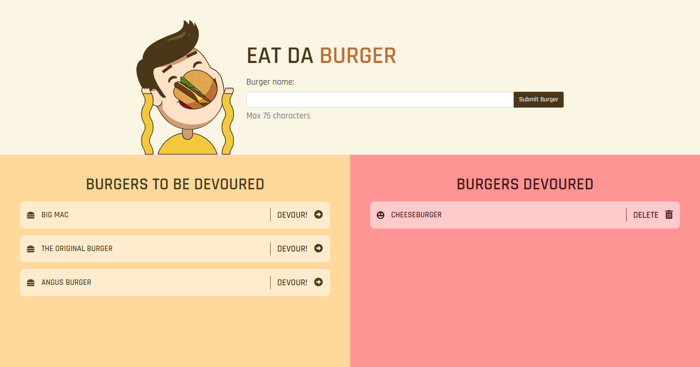
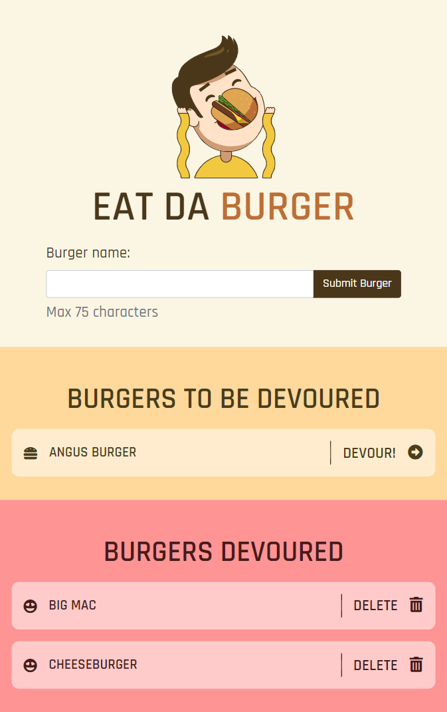

# Eat Da Burger

  
  

:link: [Go to the Burger Logger](https://fast-oasis-01993.herokuapp.com/index)

A burger logger, which tracks the burgers you want to eat or have eaten.

Acceptance criteria, a file structure and high-level instructions were given for this assignment.

## Purpose

This assignment is practice for working in the front-end and the back-end by performing simple queries to a database.

## Local Installation

1. Run `npm install` before using the application locally.
2. Set up the database using the files found in [`db`](./db). A [`seeds.sql`](./db/seeds.sql) file is provided for dummy data.
3. Configure the `user` and `password` properties found in [`connection.js`](./config/connection.js).

## Built with

### Back-End

- [Node.js](https://nodejs.org/en/)
- [Node MySQL 2](https://www.npmjs.com/package/mysql2)
- [Express](https://expressjs.com/)
- [Express Handlebars](https://www.npmjs.com/package/express-handlebars)

### Front-end

- [Bootstrap](https://getbootstrap.com/)
- [Font Awesome](https://fontawesome.com/)

## License

This project is licensed under the **MIT License**.
